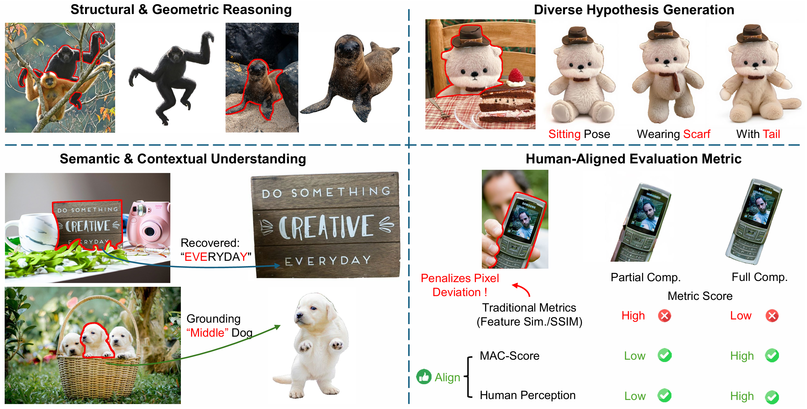
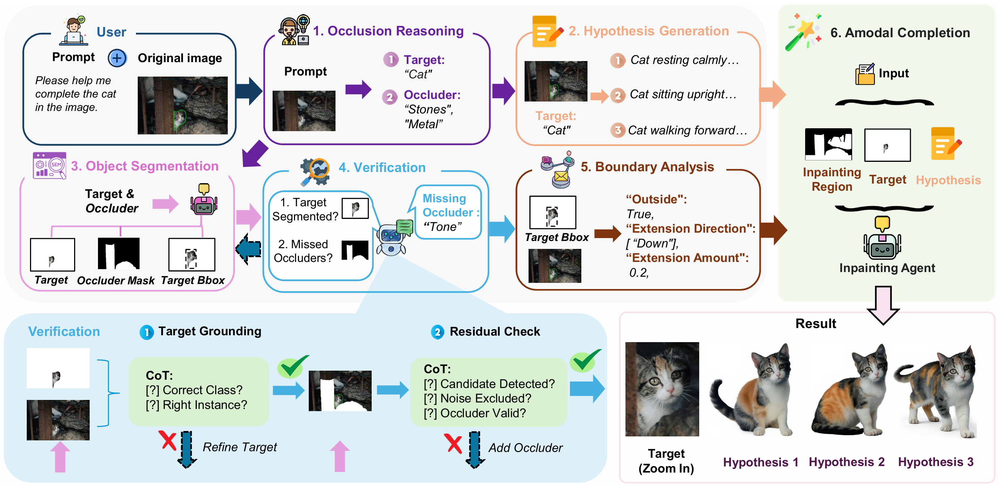

# Reasoning-Driven Amodal Completion (ReMAC)

> **Note**: This project is currently under active development.

[Arxiv 2025] **Reasoning-Driven Amodal Completion: Collaborative Agents and Perceptual Evaluation**


Abstract: Amodal completion, the task of inferring invisible object parts, faces significant challenges in maintaining semantic consistency and structural integrity. Prior progressive approaches are inherently limited by inference instability and error accumulation. To tackle these limitations, we present a Collaborative Multi-Agent Reasoning Framework that explicitly decouples Semantic Planning from Visual Synthesis. By employing specialized agents for upfront reasoning, our method generates a structured, explicit plan before pixel generation, enabling visually and semantically coherent single-pass synthesis. We integrate this framework with two critical mechanisms: (1) a self-correcting Verification Agent that employs Chain-of-Thought reasoning to rectify visible region segmentation and identify residual occluders strictly within the Semantic Planning phase, and (2) a Diverse Hypothesis Generator that addresses the ambiguity of invisible regions by offering diverse, plausible semantic interpretations, surpassing the limited pixel-level variations of standard random seed sampling. Furthermore, addressing the limitations of traditional metrics in assessing inferred invisible content, we introduce the MAC-Score (MLLM Amodal Completion Score), a novel human-aligned evaluation metric. Validated against human judgment and ground truth, these metrics establish a robust standard for assessing structural completeness and semantic consistency with visible context. Extensive experiments demonstrate that our framework significantly outperforms state-of-the-art methods across multiple datasets.
## Overview



## Installation & Setup

This project relies on multiple backend services that should be set up in separate environments (e.g., Conda environments) to avoid dependency conflicts.

### 1. Main Environment (Agent Orchestrator)

Clone this repository and install the dependencies for the main agent logic.

```bash
git clone https://github.com/your-username/remac.git
cd remac
pip install -r requirements.txt
```

### 2. Backend Services Setup

You need to set up and run the following three API servers. It is recommended to use separate Conda environments for each to avoid dependency conflicts. Please refer to their respective repositories for installation instructions.

#### A. X-SAM Server (Segmentation)

*   **Repository**: [X-SAM](https://github.com/wanghao9610/X-SAM)
*   **Running the Server**:
    Activate the X-SAM environment and run our wrapper script:
    ```bash
    conda activate xsam
    export PYTHONPATH=/path/to/X-SAM:$PYTHONPATH
    
    # Run the server (Default port: 8062)
    python api_server_xsam.py
    ```

#### B. Grounded-SAM Server (Segmentation)

*   **Repository**: [Grounded-Segment-Anything](https://github.com/IDEA-Research/Grounded-Segment-Anything)
*   **Running the Server**:
    Activate the Grounded-SAM environment and run our wrapper script:
    ```bash
    conda activate gsam
    
    # Run the server (Default port: 8040)
    python api_server_sam.py
    ```

#### C. FLUX ControlNet Inpainting Server (Inpainting)

*   **Repository**: [FLUX-Controlnet-Inpainting](https://github.com/alimama-creative/FLUX-Controlnet-Inpainting)
*   **Running the Server**:
    Activate the FLUX environment and run our wrapper script:
    ```bash
    conda activate flux
    
    # Run the server (Default port: 8041)
    python api_server_flux.py
    ```

## Usage

Once all three backend servers (X-SAM, Grounded-SAM, FLUX) are running, you can run the main agent.

### Single Image Inference

Use the `run_single.sh` script to process a single image.

```bash
# Configure your API keys for LLMs
export OPENAI_API_KEY="your_key"

# Run the script
./run_single.sh
```

You can customize the run by setting environment variables or modifying the script:

*   `IMAGE`: Path to the input image.
*   `SEG_TEXT`: Text description for segmentation (e.g., "phone").
*   `SEG_BACKEND`: `xsam` (default) or `sam`.
*   `LLM_GENERAL`: Vision model for general reasoning (`gpt4o` or `qwen`).
*   `LLM_CHECK`: Model for self-correction/checking (`gemini` or `qwen`).

### Batch Processing

Use `run_batch.sh` for processing a dataset.

```bash
./run_batch.sh
```

## Evaluation (MAC-Score)

To evaluate the results using our MAC-Score (MLLM Amodal Completion Score), use the `metric/api_mac_scores.py` script. This metric assesses both completeness and consistency.

### Prerequisites

Set the environment variables for your chosen LLM provider (SiliconFlow or OpenRouter).

```bash
# For SiliconFlow
export SILICONFLOW_API_KEY="your_api_key"
export SILICONFLOW_BASE_URL="https://api.siliconflow.cn/v1"

# For OpenRouter
export OPENROUTER_API_KEY="your_api_key"
```

### Running Evaluation

```bash
python metric/api_mac_scores.py \
    --provider openrouter \
    --model "Qwen/Qwen3-VL-32B-Instruct" \
    --root-dir path/to/data \
    --out-dir path/to/results
```

*   `--provider`: `siliconflow` (default) or `openrouter`.
*   `--model`: The VLM model to use (e.g., `Qwen/Qwen3-VL-32B-Instruct`).
*   `--root-dir`: Root directory containing the `image` subdirectory (originals) and model output subdirs.
*   `--out-dir`: Directory to save the evaluation results.

<!-- ## Citation

If you find this code useful, please cite our paper:

```bibtex
@article{remac2025,
  title={Reasoning-Driven Amodal Completion: Collaborative Agents and Perceptual Evaluation},
  author={Your Name and Others},
  journal={arXiv preprint},
  year={2025}
}
``` -->
